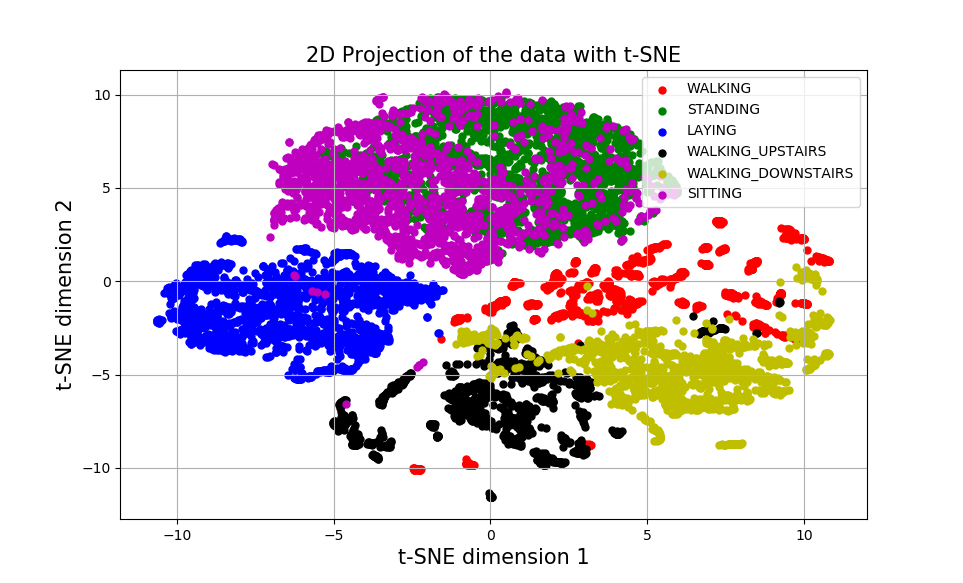
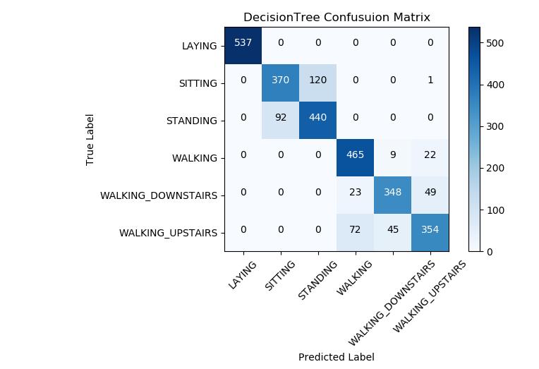

# Human-Activity-Recognition
Human Activity Recognition Using Smartphones Data Set

# Dataset
The experiments have been carried out with a group of 30 volunteers. Each person performed six activities (WALKING, WALKING_UPSTAIRS, WALKING_DOWNSTAIRS, SITTING, STANDING, LAYING) wearing a smartphone (Samsung Galaxy S II) on the waist. Using its embedded accelerometer and gyroscope,  3-axial linear acceleration and 3-axial angular velocity are captured at a constant rate of 50Hz.Feature variables for the dataset were calculated from the accelerometer signals in the time and frequency domain, including the mean, standard deviation, signal
magnitude, entropy, and signal frequency. The final product is a dataset in 563 dimensions, where 21 participants helped to make the training dataset and the remaining 9 made the testing dataset.

# Data Visualization
To gauge the feasibility of various models, the training data is first embedded into lower dimensions. This process is important for capturing and understanding the structure of the data. Using t-distributed stochastic neighbor embedding (t-SNE) and principal component analysis (PCA).

First figure illustrates the limits of using PCA for data visualization: although these two principal components account for more than 90% of the data's variance, PCA can only represent the structure of the data through linear subspaces. t-SNE does a better job of partitioning the data into its constituent classes since t-SNE can capture non-linearity in data.

# Models

I evaluated the performance of various classification algorithms, namely Logistic Re
gression, k-nearest neighbors(KNN), decision trees, naive bayes, and support vector machines
(SVM). For KNN and SVM, I performed a grid search to find the best C value and kernel
type for SVM and k value for KNN.

In addition to conventional classifiers, I also evaluated the performance of a deep neural
network classifier on the dataset. The classifier was implemented using Keras libraries.
Models in Keras are defined as a sequence of layers. Hence, I added layers one at a time until
I achieve the desired network topology. In the model, I used a fully-connected 2 hidden
layers and 2 dropout layers. The dropout layers were added to prevent over-fitting. For fully
connected layers, I specified the activation function as rectified linear units (ReLU). At the
output layer, I used a softmax classifier with a cross-entropy loss function. The ADAM
optimization algorithm was used to update the weights of the network.

The dataset has been split into 70% training and 30% test sets to evaluate the performance of the models used. All models will
be tested on scaled original data (setting the mean to 0 and standard deviation to 1), on a PCA projection that captures at least 90% of the variance, and on data that has had its dimensionality reduced via linear discriminant analysis (LDA).

Liner discriminant analysis is similar to PCA, in that they both aim to represent the data by finding a linear combinations of features. Unlike PCA, LDA aims to discriminate between the classes, rather than finding linear combinations of features that capture the data's variance. Intuitively, to transform data using LDA, a hyperplane is found, and the data is projected onto this hyperplane. As the aim of the transformation is to discriminate between classes, the hyperplane is chosen to maximize the distance between the means of the classes
while also minimizing the "scatter" of the projected classes. In particular, it maximizes the ratio of mean diferences to the sums of the scatter. In this way, LDA strives to transform the data such that classes are "dense" and separate. Note to that the dimension of the
chosen hyperplane is one less than the number of classes. So when applying LDA to the previously discussed data, the dimension is reduced from 563 to 5.

# Results

Perhaps unsurprisingly, all models performed very well on data that was transformed via Linear Discriminant Analysis.
Notably, the Naive Bayes classifier is the worst classifier on the original data, but is the
second best classifier on the data that has been transformed using LDA. The Naive Bayes
model assumes that continuous features are normally distributed. It is possible that following
the application of LDA, the features adhere more closely to a gaussian. LDA projects the
features onto a hyperplane that simultaneously attempts to maximize the distance between
the means of the different classes while also minimizing the "scatter" of the projected features
of each class. Hence, if LDA accomplishes this, then each class is densely grouped and
separated from each other, so each class may be well approximated by a gaussian.

In contrast to LDA, PCA generally did not improve the accuracy for most models. This
is to be expected, as PCA does not transform the data with the intention of discriminating
between classes. While eliminating dimensions with less variance could potentially help to
avoid overfitting, given a somewhat limited training set that does not appear to be the
case. A significant advantage to both PCA and LDA, however, is time. Note that logistic
regression has identical performance on the original and LDA-transformed data, but runs
15 times faster on the LDA-transformed data. Similar speedups are attained for both the
decision tree and k-NN. Timing data includes the time required to transform the data, so
performance is remarkable: the LDA transformation both improves accuracy and run time.

Acccuracy Scores

Model |Original | PCA | LDA
|------ | --------|----|---
Logistic Regression | %96.2|%91.1|%96.2
QDA | %85.8|%90.7|%96.9
k-NNN | %88.8|%84.1|%96.1
Decision Tree | %85.3|%80.8|%95.0
Naive Bayes | %77.0 |%86.8|%96.7
SVM | %95.6 |%91.5|%96.5
DNN | %94.2 |%90.8 |%95.8

Timing Scores (sec)

Model |Original | PCA | LDA
|------ | --------|----|---
Logistic Regression | 13.7 |0.091 | 0.84
QDA | 1.01 | 0.46 | 0.79
k-NNN |11.34 |1.43|0.81
Decision Tree | 3.51| 0.69|0.80
Naive Bayes | 0.21 |0.44 |0.79
SVM | 7.59 |1.96|0.87

# References

The <a href="https://archive.ics.uci.edu/ml/datasets/Human+Activity+Recognition+Using+Smartphones">dataset</a> can be found on the UCI Machine Learning Repository.
